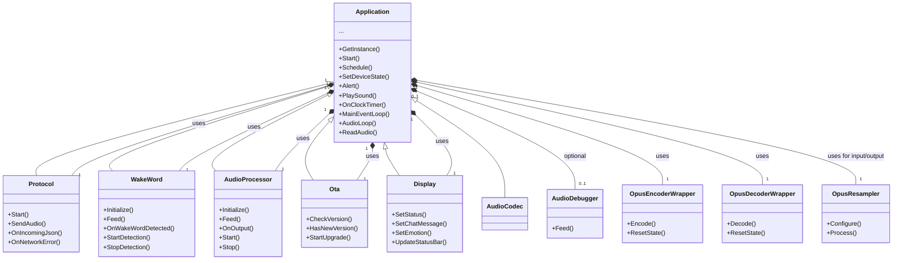
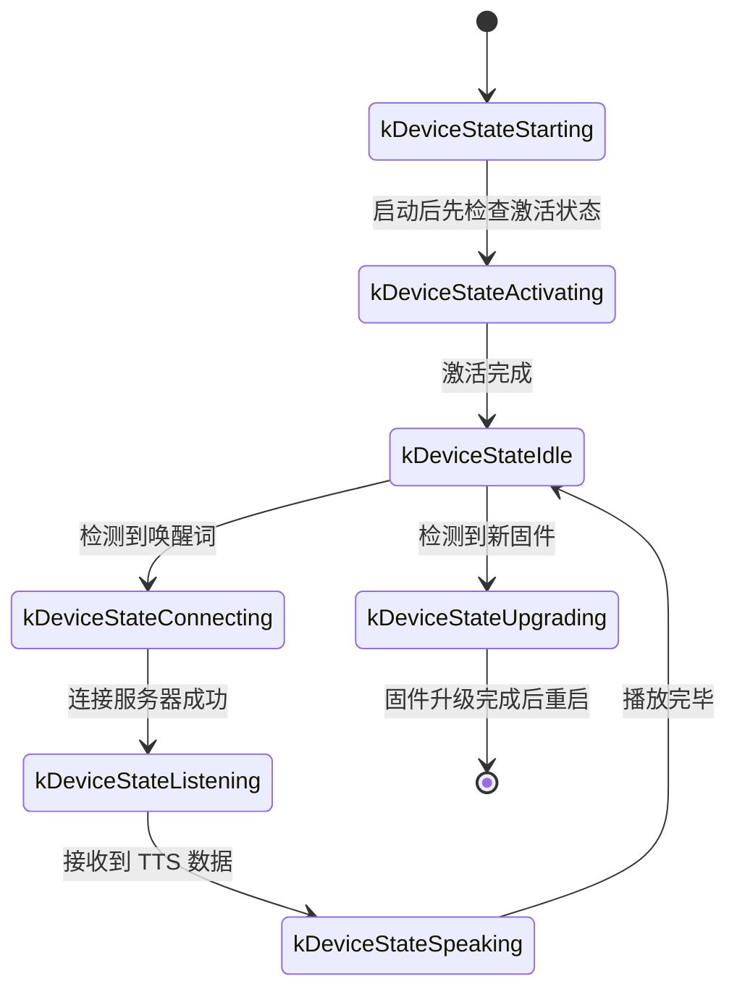
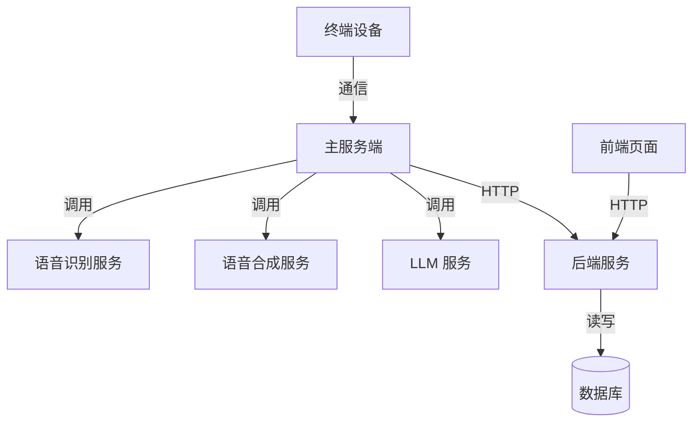
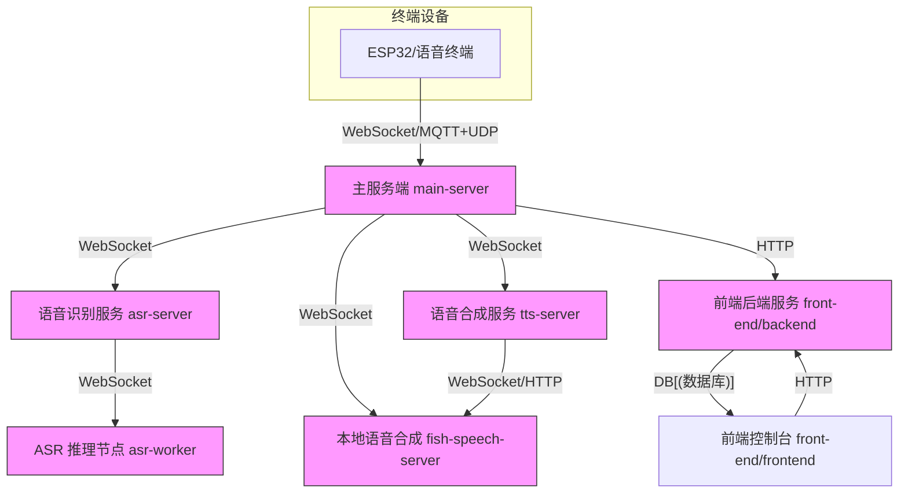
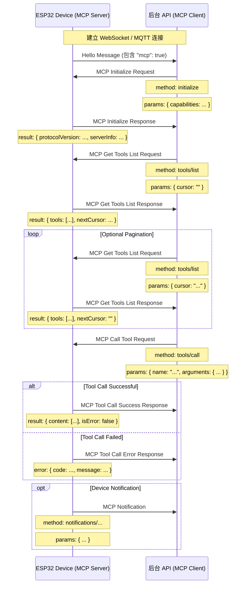
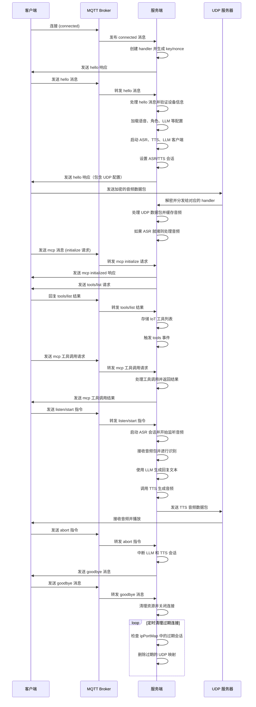
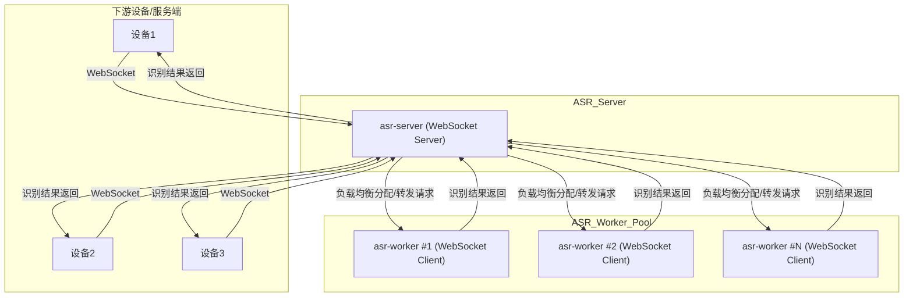
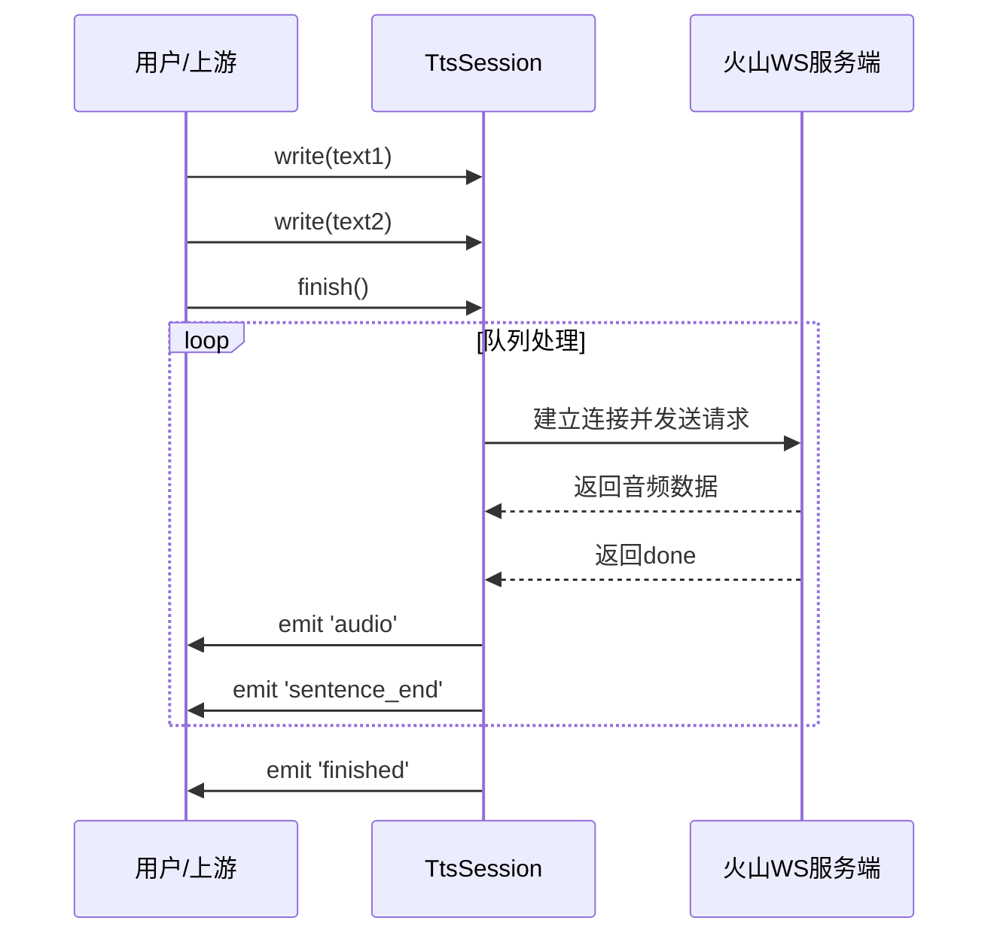

```mermaid
classDiagram
    Application <|-- Protocol
    Application <|-- WakeWord
    Application <|-- AudioProcessor
    Application <|-- Ota
    Application <|-- Display
    Application <|-- AudioCodec
    
    class Application {
        +GetInstance()
        +Start()
        +Schedule()
        +SetDeviceState()
        +Alert()
        +PlaySound()
        +OnClockTimer()
        +MainEventLoop()
        +AudioLoop()
        +ReadAudio()
        ...
    }
    
    class WakeWord {
        +Initialize()
        +Feed()
        +OnWakeWordDetected()
        +StartDetection()
        +StopDetection()
    }

    class AudioProcessor {
        +Initialize()
        +Feed()
        +OnOutput()
        +Start()
        +Stop()
    }

    class AudioDebugger {
        +Feed()
    }

    class Protocol {
        +Start()
        +SendAudio()
        +OnIncomingJson()
        +OnNetworkError()
    }

    class Ota {
        +CheckVersion()
        +HasNewVersion()
        +StartUpgrade()
    }

    class Display {
        +SetStatus()
        +SetChatMessage()
        +SetEmotion()
        +UpdateStatusBar()
    }

    class OpusEncoderWrapper {
        +Encode()
        +ResetState()
    }

    class OpusDecoderWrapper {
        +Decode()
        +ResetState()
    }

    class OpusResampler {
        +Configure()
        +Process()
    }

    Application "1" *-- "1" WakeWord : uses
    Application "1" *-- "1" AudioProcessor : uses
    Application "0..1" *-- "0..1" AudioDebugger : optional
    Application "1" *-- "1" Protocol : uses
    Application "1" *-- "1" Ota : uses
    Application "1" *-- "1" Display : uses
    Application "1" *-- "1" OpusEncoderWrapper : uses
    Application "1" *-- "1" OpusDecoderWrapper : uses
    Application "1" *-- "1" OpusResampler : uses for input/output
```

```mermaid
stateDiagram-v2
    [*] --> kDeviceStateStarting
    kDeviceStateStarting --> kDeviceStateActivating : 启动后先检查激活状态
    kDeviceStateActivating --> kDeviceStateIdle : 激活完成
    kDeviceStateIdle --> kDeviceStateConnecting : 检测到唤醒词
    kDeviceStateConnecting --> kDeviceStateListening : 连接服务器成功
    kDeviceStateListening --> kDeviceStateSpeaking : 接收到 TTS 数据
    kDeviceStateSpeaking --> kDeviceStateIdle : 播放完毕
    kDeviceStateIdle --> kDeviceStateUpgrading : 检测到新固件
    kDeviceStateUpgrading --> [*] : 固件升级完成后重启
```

```mermaid
graph TD
    Device[终端设备]
    MainServer[主服务端]
    ASR[语音识别服务]
    TTS[语音合成服务]
    LLM[LLM 服务]
    Backend[后端服务]
    DB[(数据库)]
    Frontend[前端页面]

    Device -- 通信 --> MainServer
    MainServer -- 调用 --> ASR
    MainServer -- 调用 --> TTS
    MainServer -- 调用 --> LLM
    MainServer -- HTTP --> Backend
    Backend -- 读写 --> DB
    Frontend -- HTTP --> Backend
```

```mermaid
---
config:
  layout: dagre
---
flowchart TD
 subgraph s1["终端设备"]
        Device["ESP32/语音终端"]
  end
    Device -- WebSocket/MQTT+UDP --> MainServer["主服务端 main-server"]
    MainServer -- WebSocket --> ASRServer["语音识别服务 asr-server"] & TTSServer["语音合成服务 tts-server"] & FishSpeech["本地语音合成 fish-speech-server"]
    MainServer -- HTTP --> Backend["前端后端服务 front-end/backend"]
    ASRServer -- WebSocket --> ASRWorker["ASR 推理节点 asr-worker"]
    TTSServer -- WebSocket/HTTP --> FishSpeech
    Backend -- DB[(数据库)] --> Frontend["前端控制台 front-end/frontend"]
    Frontend -- HTTP --> Backend
     MainServer:::cloud
     ASRServer:::cloud
     TTSServer:::cloud
     FishSpeech:::cloud
     Backend:::cloud
     ASRWorker:::cloud
    classDef cloud fill:#f9f,stroke:#333,stroke-width:1px

```

```mermaid
sequenceDiagram
    participant Device as ESP32 Device (MCP Server)
    participant BackendAPI as 后台 API (MCP Client)

    Note over Device, BackendAPI: 建立 WebSocket / MQTT 连接

    Device->>BackendAPI: Hello Message (包含 "mcp": true)

    BackendAPI->>Device: MCP Initialize Request
    Note over BackendAPI: method: initialize
    Note over BackendAPI: params: { capabilities: ... }

    Device->>BackendAPI: MCP Initialize Response
    Note over Device: result: { protocolVersion: ..., serverInfo: ... }

    BackendAPI->>Device: MCP Get Tools List Request
    Note over BackendAPI: method: tools/list
    Note over BackendAPI: params: { cursor: "" }

    Device->>BackendAPI: MCP Get Tools List Response
    Note over Device: result: { tools: [...], nextCursor: ... }

    loop Optional Pagination
        BackendAPI->>Device: MCP Get Tools List Request
        Note over BackendAPI: method: tools/list
        Note over BackendAPI: params: { cursor: "..." }
        Device->>BackendAPI: MCP Get Tools List Response
        Note over Device: result: { tools: [...], nextCursor: "" }
    end

    BackendAPI->>Device: MCP Call Tool Request
    Note over BackendAPI: method: tools/call
    Note over BackendAPI: params: { name: "...", arguments: { ... } }

    alt Tool Call Successful
        Device->>BackendAPI: MCP Tool Call Success Response
        Note over Device: result: { content: [...], isError: false }
    else Tool Call Failed
        Device->>BackendAPI: MCP Tool Call Error Response
        Note over Device: error: { code: ..., message: ... }
    end

    opt Device Notification
        Device->>BackendAPI: MCP Notification
        Note over Device: method: notifications/...
        Note over Device: params: { ... }
    end
```

```mermaid
sequenceDiagram
    participant Client as 客户端
    participant MQTT_Server as MQTT Broker
    participant Server as 服务端
    participant UDP_Server as UDP 服务器

    Client->>MQTT_Server: 连接 (connected)
    MQTT_Server->>Server: 发布 connected 消息

    Server->>Server: 创建 handler 并生成 key/nonce
    Server->>Client: 发送 hello 响应

    Client->>MQTT_Server: 发送 hello 消息
    MQTT_Server->>Server: 转发 hello 消息

    Server->>Server: 处理 hello 消息并验证设备信息
    Server->>Server: 加载语音、角色、LLM 等配置
    Server->>Server: 启动 ASR、TTS、LLM 客户端
    Server->>Server: 设置 ASR/TTS 会话
    Server->>Client: 发送 hello 响应（包含 UDP 配置）

    Client->>UDP_Server: 发送加密的音频数据包
    UDP_Server->>Server: 解密并分发给对应的 handler

    Server->>Server: 处理 UDP 数据包并缓存音频
    Server->>Server: 如果 ASR 就绪则处理音频

    Client->>MQTT_Server: 发送 mcp 消息 (initialize 请求)
    MQTT_Server->>Server: 转发 mcp initialize 请求

    Server->>Client: 发送 mcp initialized 响应
    Server->>Client: 发送 tools/list 请求

    Client->>MQTT_Server: 回复 tools/list 结果
    MQTT_Server->>Server: 转发 tools/list 结果

    Server->>Server: 存储 IoT 工具列表
    Server->>Server: 触发 tools 事件

    Client->>MQTT_Server: 发送 mcp 工具调用请求
    MQTT_Server->>Server: 转发 mcp 工具调用请求

    Server->>Server: 处理工具调用并返回结果
    Server->>Client: 发送 mcp 工具调用结果

    Client->>MQTT_Server: 发送 listen/start 指令
    MQTT_Server->>Server: 转发 listen/start 指令

    Server->>Server: 启动 ASR 会话并开始监听音频
    Server->>Server: 接收音频包并进行识别

    Server->>Server: 使用 LLM 生成回复文本
    Server->>Server: 调用 TTS 生成音频
    Server->>UDP_Server: 发送 TTS 音频数据包
    UDP_Server->>Client: 接收音频并播放

    Client->>MQTT_Server: 发送 abort 指令
    MQTT_Server->>Server: 转发 abort 指令

    Server->>Server: 中断 LLM 和 TTS 会话
    Server->>Client: 发送 goodbye 消息

    Client->>MQTT_Server: 发送 goodbye 消息
    MQTT_Server->>Server: 转发 goodbye 消息

    Server->>Server: 清理资源并关闭连接

    loop 定时清理过期连接
        Server->>Server: 检查 ipPortMap 中的过期会话
        Server->>Server: 删除过期的 UDP 映射
    end
```

```mermaid
flowchart TD
    subgraph 下游设备/服务端
        Client1["设备1"]
        Client2["设备2"]
        Client3["设备3"]
    end

    subgraph ASR_Server
        ASRServer["asr-server (WebSocket Server)"]
    end

    subgraph ASR_Worker_Pool
        Worker1["asr-worker #1 (WebSocket Client)"]
        Worker2["asr-worker #2 (WebSocket Client)"]
        WorkerN["asr-worker #N (WebSocket Client)"]
    end

    Client1 -- WebSocket --> ASRServer
    Client2 -- WebSocket --> ASRServer
    Client3 -- WebSocket --> ASRServer

    ASRServer -- 负载均衡分配/转发请求 --> Worker1
    ASRServer -- 负载均衡分配/转发请求 --> Worker2
    ASRServer -- 负载均衡分配/转发请求 --> WorkerN

    Worker1 -- 识别结果返回 --> ASRServer
    Worker2 -- 识别结果返回 --> ASRServer
    WorkerN -- 识别结果返回 --> ASRServer

    ASRServer -- 识别结果返回 --> Client1
    ASRServer -- 识别结果返回 --> Client2
    ASRServer -- 识别结果返回 --> Client3
```

```mermaid
sequenceDiagram
    participant User as 用户/上游
    participant Session as TtsSession
    participant WS as 火山WS服务端

    User->>Session: write(text1)
    User->>Session: write(text2)
    User->>Session: finish()

    loop 队列处理
        Session->>WS: 建立连接并发送请求
        WS-->>Session: 返回音频数据
        WS-->>Session: 返回done
        Session->>User: emit 'audio'
        Session->>User: emit 'sentence_end'
    end

    Session->>User: emit 'finished'
```
